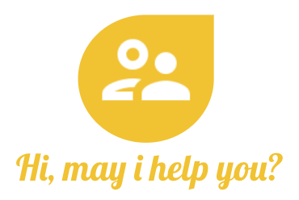

# **HI** is for Human Intelligence
**HI, May I Help You?** is a Video-Call plugin for your website where you can offer human assistance to your visitors.

# Beyond video calls and Call Centers

With HI you can help your customers by navigating together your website, showing them where to go, what to click.

# A real shopping experience
 

With **Hi, may i help you?** your customer will enjoy as it was at the shop with you.

# Features

## Video chat

Customer support will talk face to face with the customer.

### One to many

You can use HI for training a group of customers.

## Chat room

You can send and receive links, images and all kind of useful information to your customers through the chat interface.

# Embbed into your website

Easy integration with your website

    
    

# Sponsors

### Credits
<a href="https://www.vecteezy.com/free-vector/cart-icon">Cart Icon Vectors by Vecteezy</a>